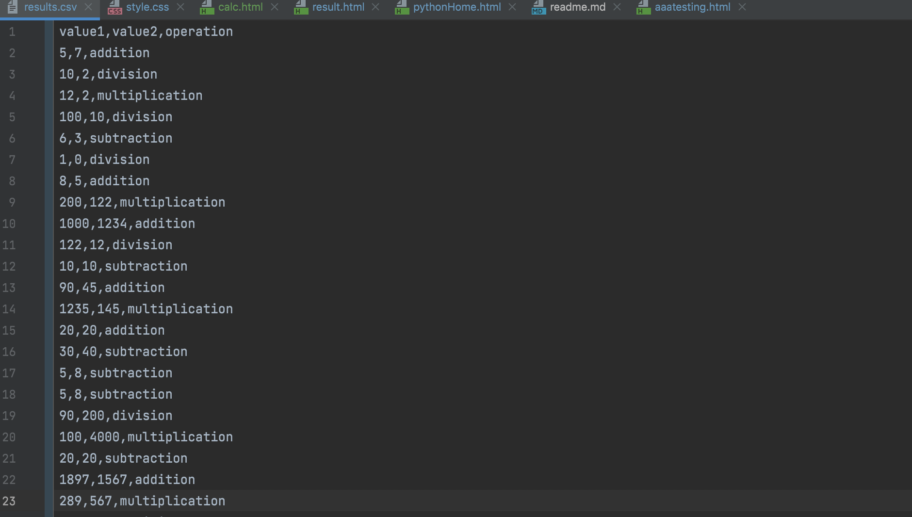

# Calculator Project Setup
Result CSV:

Test results:

Result table image:

To run tests, Lint, and Coverage report use this command:

pytest  --pylint --cov

.pylintrc is the config for pylint
.coveragerc is the config for coverage
setup.py is a config file for pytest
