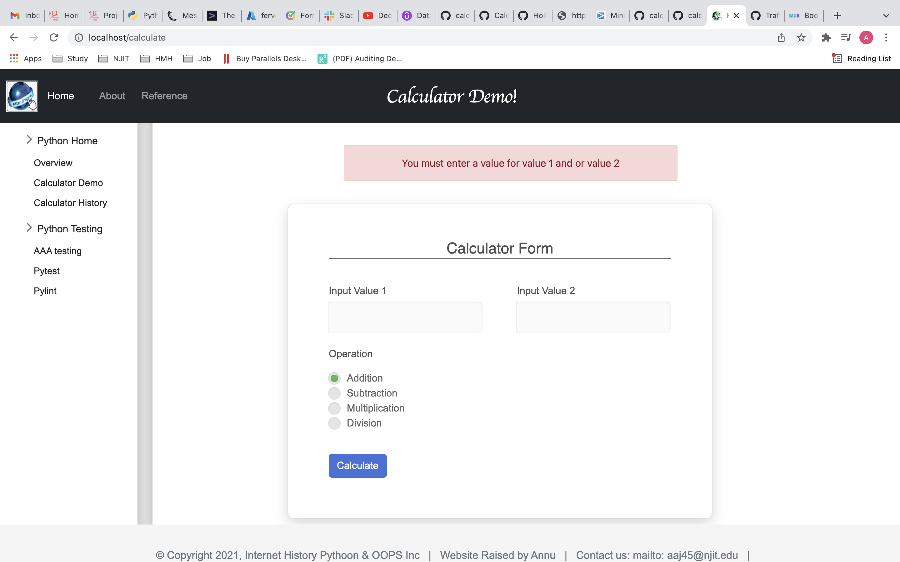

# Calculator Project Setup
Flash message images:

To run tests, Lint, and Coverage report use this command:

pytest  --pylint --cov

.pylintrc is the config for pylint
.coveragerc is the config for coverage
setup.py is a config file for pytest
